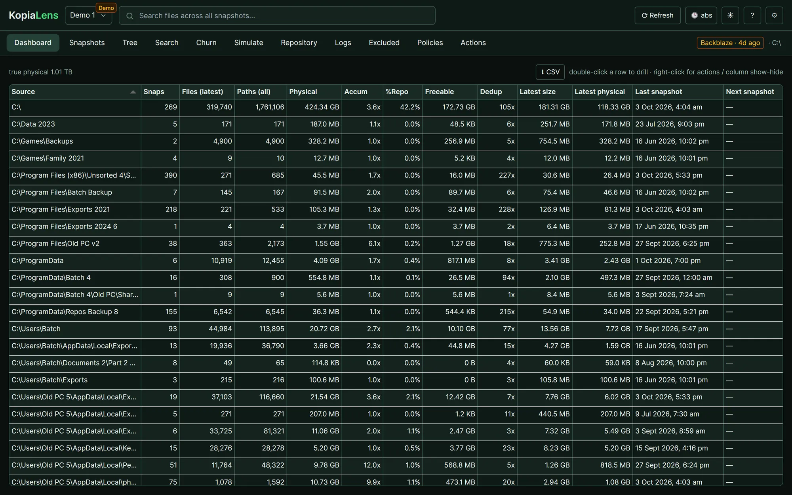

  

<h1 align="center">KopiaLens</h1>

<b>Find what's bloating your Kopia backups. Get the space back.</b>

  <a href="https://kopialens.com">Website</a> ·
  <a href="https://kopialens.com/docs">Docs</a> ·
  <a href="https://kopialens.com/#waitlist">Join the waitlist</a>

KopiaLens shows the real size of everything in your [Kopia](https://kopia.io) repository, finds the files you never meant to keep, and removes them from every snapshot that holds them, with a dry run first.

It runs alongside KopiaUI and the kopia command line, on the repository you already have.

## What it does

- See where the space goes: every backed-up folder with its real cost after deduplication
- Find any file in any snapshot, with every version of it
- Rank snapshots by how much deleting them would free
- Catch the folders that rewrite themselves on every backup
- Browse any snapshot like a disk
- Try a retention policy before you use it
- Write exclusions that do what you meant, and check what isn't backed up
- Remove files and folders from existing snapshots (Pro)

## Runs where your backups live

A desktop app for Windows, macOS and Linux, and Docker for servers and NAS boxes. Open it from any browser on your network.

## Free and Pro

Everything KopiaLens shows you is free, with no time limit. Pro adds the actions that remove data from inside your backups. [See pricing](https://kopialens.com/pricing).

## Coming soon

KopiaLens is in final testing. [Join the waitlist](https://kopialens.com/#waitlist) to get launch pricing and hear the day it ships.

## Bugs, ideas and questions

- Found a bug or want a feature? [Open an issue](../../issues/new/choose).
- Questions and setup help: [the docs](https://kopialens.com/docs) or support@kopialens.com.

This repository holds KopiaLens's releases and issue tracker. The docs live at [kopialens.com/docs](https://kopialens.com/docs).

## Support the project

KopiaLens is built by one independent developer. If you'd like to back its development, use the Sponsor button at the top of this page, or see [kopialens.com/sponsor](https://kopialens.com/sponsor).

---

KopiaLens is an independent app for Kopia. It isn't made, endorsed or supported by the Kopia project.
